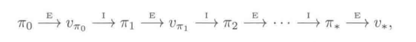

<!--
 * @Author: renjie renjie_dlut2016@163.com
 * @Date: 2024-07-29 16:17:58
 * @LastEditors: renjie renjie_dlut2016@163.com
 * @LastEditTime: 2024-08-09 18:22:21
 * @FilePath: /Simple_Reinforcement_Learning/RL_test/readme.md
 * @Description: 这是默认设置,请设置`customMade`, 打开koroFileHeader查看配置 进行设置: https://github.com/OBKoro1/koro1FileHeader/wiki/%E9%85%8D%E7%BD%AE
-->
Hello, Reinforcement Learning;以交互目标为导向进行学习
"试探exploriing"和"开发exploitation"之间的折中权衡.
# 导论
## RL要素
## 多臂赌博机
1. $\epsilon$-贪心方法
    - 高$\epsilon$,试探会更多,通常更早发现最优动作,但最终性能不及低$\epsilon$
    - 为了充分利用高和低的$\epsilon$的优势,随着时间推移来逐步减小$\epsilon$

2. 增量式实现
3. 跟踪一个非平稳问题.
   - 给近期的收益赋予比过去更久的收益更高的权值是一种合理的处理方式.
   - **指数近因加权平均**: 融合了**指数加权平均**和 **近因加权**
4. 乐观初始值:
   - 刚开始乐观初始化方法表现得比较糟糕,需要试探更多次,但是最终随着时间的推移,试探的次数减少,表现也变得更好.
5. 置信度上界UCB(**upper confidence bound**)
   $ A_t = \arg \max_a \big ( Q_t(a)+c \sqrt{ \frac{\ln t}{N_t(a)}} \big) $
   - 其中平方根项是对动作a价值的**不确定性或方差**的度量.
   - 所有动作最终都将被选中
   - 具有较低价值估计的动作或者已经被选择了更多次的动作被选择的频率较低.
6. 梯度赌博机算法
    $
        H_{t+1}(A_t) = H_t(A_t) + \alpha (R_t-\overline{R}_t)(1-\pi_t(A_t)) ,\\
        H_{t+1}(a) = H_t(a) - \alpha (R_t-\overline{R}_t)\pi_t(a),  所有a \neq A_t
    $
7. 贝叶斯方法:汤普森采样.
## 有限马尔科夫决策过程MDP
1. 目标和收益**reward**
2. 回报**return**和分幕**episode**
3. **策略**:状态到每个动作的选择概率之间的映射.
4. 状态价值函数
   $$ v_\pi (s) = E_\pi[G_t|S_t=s] \\
    = E_\pi[\sum^\infty_{k=0} \gamma^kR_{t+k+1}|S_t=s ] \\
    = E_\pi[R_{t+1}+\gamma G_{t+1}|S_t=s] \\
    = \sum_a \pi(a|s)\sum_{s^\prime}\sum_r p(s^\prime,r|s,a)[r+\gamma E_\pi[G_{t+1}|S_{t+1}=s^\prime]] \\
    = \sum_a \pi(a|s)\Big[\sum_r p(r|s,a)r + \gamma\sum_{s\prime}p(s\prime|s,a)v_\pi(s\prime)\Big]
   $$

   动作价值函数: 在状态s下,先采取动作a,之后按照最优策略去决策的期望回报.
    $$
     q_\pi(s,a) = E_\pi[G_t|S_t=s,A_t=a] =E_\pi[\sum^\infty_{k=0} \gamma^kR_{t+k+1}|S_t=s, A_t=a]
    $$
    - 蒙特卡罗方法
    - 参数化
5. 最优策略和最优价值函数
    $$
     v_\ast = \max_\pi v_\pi(s)
    $$

    $$
     q_\ast(s,a)=\max_\pi q_\pi(s,a)
    $$

## 动态规划DP(dynamic programming)
1. **策略评估PE**:根据给定的策略,得到所有可能的单步转移之后的即时收益和s的每个后继状态的旧价值函数,利用两者的期望值来更新s的新价值函数.
2. **策略提升PI**: 
   $$
    \pi^\prime(s)=\arg \max_a q_\pi(s,a) \\
    = \arg \max_a E[R_{t+1}+\gamma v_\pi(S_{t+1})|S_t=s,A_t=a] \\
    = \arg \max_a \sum_{s^\prime,r}p(s^\prime,r|s,s)[r+\gamma v_\pi(s^\prime)]
   $$
3. **策略迭代**:
   
4. **价值迭代**:在一次遍历后即刻停止策略评估(对每个状态进行一次更新)
5. **广义策略迭代GPI**

## 蒙特卡洛方法

# 重要概念
1. **自举**: 利用已有的估计值(状态价值,动作价值)来更新当前的估计值的过程.时序差分TD是一种自举.
2. **评估性反馈**与 **指导性反馈**
3. **利用(exploitation)**与**试探(exploration)**
4. **优化控制**,**试错理论**,**时序差分**:
5. **行动器-评判器AC(actor-critic)**: 试错学习中使用时序差分学习
6. **时序差分**:价值变化更新的部分依赖于两个不同时刻的状态的价值的差.
7. **开环(open-loop)**与**闭环(closed-loop)**:主要区别在于系统是否根据环境或输出的反馈来调整其输入或行为.
8. **Q-learning**:是一种基于模型的强化学习技术,利用环境模型(状态转移概率和奖励函数)来生成模拟数据,进而通过模拟数据来更新动作价值函数的方法.(**模拟数据生成**,**价值函数更新**)
9. **Dyna-Q**:agent在模型生成的模拟环境中进行规划和学习,同时也在真实环境中进行交互和学习.
10. **蒙特卡罗**:指一类使用随机样本来解决估计问题的技术.
11. **贪心策略**:在计算机科学中,贪心用力啊描述仅基于局部或则当前情况进行最优选择,完全不考虑未来的变数和影响,对于动作的选择仅仅基于短期的结果.